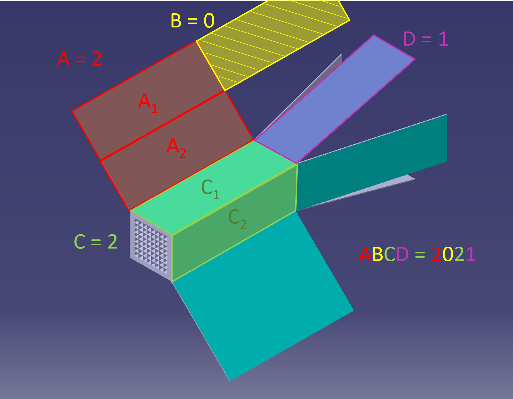
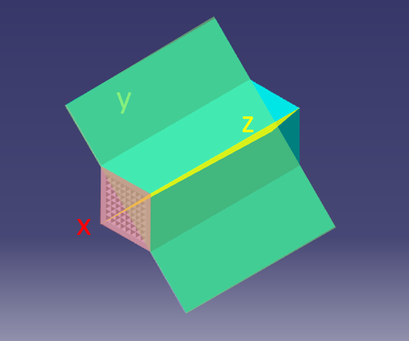
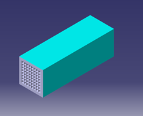
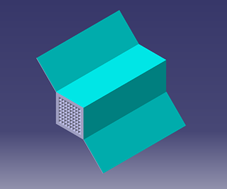
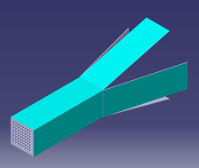
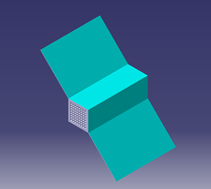
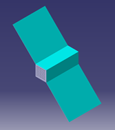
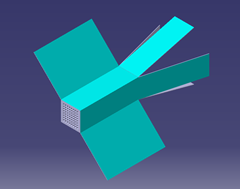
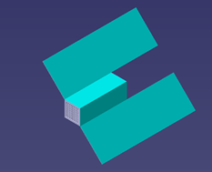
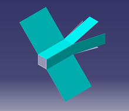

# SPARTA

The Stochastic PArallel Rarefied-gas Time-accurate Analyzer (SPARTA) software library has been used to get the drag coefficient of the satellite given different atmospheric conditions. SPARTA is a Direct Simulation Monte Carlo (DSMC) simulator, suited for rarefied flow simulations.

## Installation
The SPARTA documentation can be accessed [here](https://sparta.github.io/).

Moreover, it can be installed and compiled by running the following commands:
```
git clone https://github.com/sparta/sparta
cd sparta
mkdir build
cd build
module load openmpi
cmake -LH /path/to/sparta/cmake
make
```
The `spa_` combipled file will then be found in `build/src`.

This folder can be added to path using the following command:
```
echo "export PATH=\$PATH:/path/to/sparta/build/src" >> ~/.bash_profile
```

## Commands

Once SPARTA has been compiled, and the path to the `spa_` file added to path, the following commands can be used.

To run SPARTA on a given input script (for instance, satellite input script `in.sat`), the following command can be used:
```
spa_ < in.sat
```

SPARTA can be run on different CPU cores in parallel, if it was compiled with MPI.
Note that, doing so, the computer may run out of memory faster.
The following command can be used for this:
```
mpirun -np 12 spa_ < in.sat
```

In the input file, pictures can be generated at given time steps (with file extension `.ppm`).
With ImageMagick installed, the following command can be used to tranform them to an animated `.gif` file:
```
convert image*ppm movie.gif
```

Most CAD softwares such as CATIA generate a binary STL file. To convert it to an ASCII STL file, the following command can be used (with `stl_B2A.py` from the [tools folder](tools)):
```
python2 stl_B2A.py model.stl
```
Additionally, the `-rs` option can be added to rescale the binary STL from `mm` to `m` when translating it to ASCII:
```
python2 stl_B2A.py model.stl -rs
```

Finally, to convert an ASCII STL file to a surface that SPARTA understands, the following command can be used (with `stl2surf.py` from the [tools folder](tools)):
```
python2 stl2surf.py model_ascii.stl data.model
```

When all of the input files have been created, they can all be run by using the following command while in the `inputs` folder:
```
bash run_all.sh
```

## Satellite configurations

Different CubeSat configurations have been modeled, each with different solar panels configurations.

The naming scheme has been taken as CS ABCD:
 * CS: CubeSat
 * A: Solar panels above and below the main body
 * B: Extension of the solar panels in A (straight behind)
 * C: Solar panels on the main body
 * D: Extension of the solar panels in C (behind, at a 15deg angle from the centreline)

The following figure illustrates this naming scheme:



The number of solar panels (of size 300x100mm) has been counted for one side of the satellite. 

As an example, the [3U deployable solar array from EnduroSat](https://www.endurosat.com/cubesat-store/cubesat-solar-panels/3u-single-deployable-solar-array) could be used.
Including PCB, these have a mass of 0.27 kg and a thickness of 1.75 mm. At EOL, they have a power efficiency of at least 29%.

Finally, the area of the solar panels of each satellite has been computed across three different planes. This later simplifies solar power calculations.
These x, y, and z planes are defined as in the figure below:



| Satellite name | # of solar panels (x2) | Reference length [m] | x-area [m2] | y-area [m2] | z-area [m2] | Illustration                           |
|----------------|------------------------|----------------------|-------------|-------------|-------------|----------------------------------------|
| CS 0020        | 2                      | 0.3                  | 0           | 0.042426    | 0.042426    |  |
| CS 1020        | 4                      | 0.341421             | 0           | 0.102426    | 0.042426    |  |
| CS 0021        | 4                      | 0.589778             | 0.031058    | 0.083343    | 0.083343    |  |
| CS 2020        | 6                      | 0.541421             | 0           | 0.162426    | 0.042426    |  |
| CS 1021        | 6                      | 0.589778             | 0.031058    | 0.143343    | 0.083343    |  |
| CS 3020        | 8                      | 0.741421             | 0           | 0.222426    | 0.042426    |  |
| CS 2021        | 8                      | 0.589778             | 0.031058    | 0.203343    | 0.083343    |  |
| CS 2120        | 10                     | 0.6                  | 0           | 0.282426    | 0.042426    |  |
| CS 3021        | 10                     | 0.741421             | 0.031058    | 0.263343    | 0.083343    |  |

## Conditions

The conditions in which the simulation has been made have been varied, as to gather different drag values, for interpolation later on.

First, the orbital altitudes have been varied between 85 km and 150 km.
This leads to the following parameters:

| Altitude [km] | Velocity [m/s] | Density [kg/m3] | Dynamic pressure [Pa] | Temperature [K] | Pressure [Pa] | Mixture [mol/mol]                                     |
|---------------|----------------|-----------------|-----------------------|-----------------|---------------|-------------------------------------------------------|
| 85            | 3494.17        | 7.1E-07         | 4.3343                | 135             | 2.3E-02       | 90.5% CO2, 3.5% N2, 2.5% Ar, 1.5% CO, 1.5% O, 0.5% O2 |
| 115           | 3493.29        | 1.8E-08         | 1.0983E-01            | 115             | 3.7E-04       | 81% CO2, 4.5% N2, 3.5% Ar, 5% CO, 5.5% O, 0.5% O2     |
| 150           | 3483.82        | 1.6E-10         | 9.7096E-04            | 175             | 7.1E-06       | 42% CO2, 12.5% N2, 4.5% Ar, 15% CO, 25% O, 1% O2      |

The velocities have been taken from the orbital simulations made in [MCD/feasible_altitudes.py](../MCD/feasible_altitudes.py).
The mixture, temperatures, pressures, and densities have been obtained from the [online interface](http://www-mars.lmd.jussieu.fr/mcd_python) of the Mars Climate Database, taking time and position averaged values.

## Input files
The script [comp_inputs.py](setup/comp_inputs.py) has then been used to generate the relevant input files for the SPARTA simulations.

These input files have been made for each satellite, for each of the satellite configurations.

These can be found in the [inputs](setup/inputs), and are of the format `in.*`.

It is worth noting that grid size has been capped to a maximum of (10, 10, 10), to avoid having the grid size too big compared to the geometry (satellite) size.

Additionally, the `f_num` parameter has been tuned to ensure that enough simulated particules are present. At h=85km, `f_num` has been increased by a factor of 100. It has been decreased by a factor of 1E3 at h=115km, and decreased by a factor of 1E7 for h=150km.

*Note that all SPARTA simulations assume that the satellite is 20% diffuse and 80% specular. This should be tuned.*

## Results

Running SPARTA for the different altitudes, the force in each direction has been saved in `.dat` files in the [results folder](results).

Then, [analyse_results.py](analyse_results.py) has been used to compute the drag force from all of the simulations.

At each altitude, the dynamic pressure (in Pa) has been computed as follows:


For each satellite configuration, the reference surface `S` has been taken as the frontal area of the cubesat itself, not including the solar panels.
In the simulation runs, `S = 0.01 m2`. This means that, later on, the same reference surface has to be used.

If the satellite is to be scaled, the solar panels must be scaled equally to the cubesat itself for the drag coefficients to be valid.

The drag coefficients have then been computed at each altitude by using the following equation:


This leads to the drag coefficients of the table below, with the Knudsen numbers included as well:

| Satellite name | Altitude [km] | Knudsen number [-] | Drag [N]    | Reference surface [m2] | Drag coefficient [-] |
|----------------|---------------|--------------------|-------------|------------------------|----------------------|
| CS 0020        | 85            | 6.871E-01          | 1.33730E-01 | 0.01                   | 3.08541              |
| CS 0020        | 115           | 2.656E+01          | 2.70496E-03 | 0.01                   | 2.46291              |
| CS 0020        | 150           | 2.755E+03          | 2.27725E-05 | 0.01                   | 2.34536              |
| CS 1020        | 85            | 6.038E-01          | 1.94733E-01 | 0.0104                 | 4.49286              |
| CS 1020        | 115           | 2.334E+01          | 4.78227E-03 | 0.0104                 | 4.35434              |
| CS 1020        | 150           | 2.421E+03          | 4.23014E-05 | 0.0104                 | 4.35666              |
| CS 0021        | 85            | 3.495E-01          | 1.75761E-01 | 0.041058               | 4.05514              |
| CS 0021        | 115           | 1.351E+01          | 3.00427E-03 | 0.041058               | 2.73544              |
| CS 0021        | 150           | 1.401E+03          | 2.59260E-05 | 0.041058               | 2.67014              |
| CS 2020        | 85            | 3.807E-01          | 2.41223E-01 | 0.0108                 | 5.56548              |
| CS 2020        | 115           | 1.472E+01          | 5.01928E-03 | 0.0108                 | 4.57014              |
| CS 2020        | 150           | 1.527E+03          | 4.45674E-05 | 0.0108                 | 4.59003              |
| CS 1021        | 85            | 3.495E-01          | 1.60198E-01 | 0.041458               | 3.69607              |
| CS 1021        | 115           | 1.351E+01          | 3.26494E-03 | 0.041458               | 2.97278              |
| CS 1021        | 150           | 1.401E+03          | 2.85346E-05 | 0.041458               | 2.93880              |
| CS 3020        | 85            | 2.780E-01          | 2.23061E-01 | 0.0112                 | 5.14644              |
| CS 3020        | 115           | 1.075E+01          | 5.34656E-03 | 0.0112                 | 4.86814              |
| CS 3020        | 150           | 1.115E+03          | 4.78650E-05 | 0.0112                 | 4.92966              |
| CS 2021        | 85            | 3.495E-01          | 2.31226E-01 | 0.041858               | 5.33483              |
| CS 2021        | 115           | 1.351E+01          | 3.61926E-03 | 0.041858               | 3.29540              |
| CS 2021        | 150           | 1.401E+03          | 3.12696E-05 | 0.041858               | 3.22048              |
| CS 2120        | 85            | 3.436E-01          | 1.85292E-01 | 0.0108                 | 4.27504              |
| CS 2120        | 115           | 1.328E+01          | 3.60861E-03 | 0.0108                 | 3.28570              |
| CS 2120        | 150           | 1.378E+03          | 3.03756E-05 | 0.0108                 | 3.12841              |
| CS 3021        | 85            | 2.780E-01          | 2.35392E-01 | 0.042258               | 5.43094              |
| CS 3021        | 115           | 1.075E+01          | 5.66496E-03 | 0.042258               | 5.15804              |
| CS 3021        | 150           | 1.115E+03          | 5.04034E-05 | 0.042258               | 5.19109              |